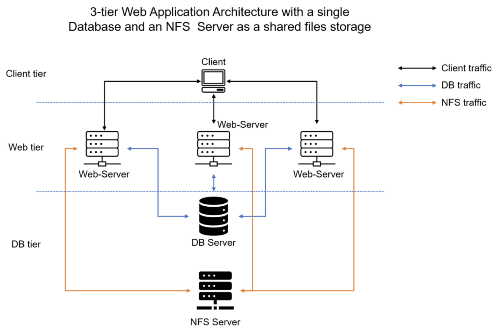
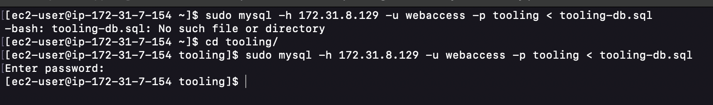
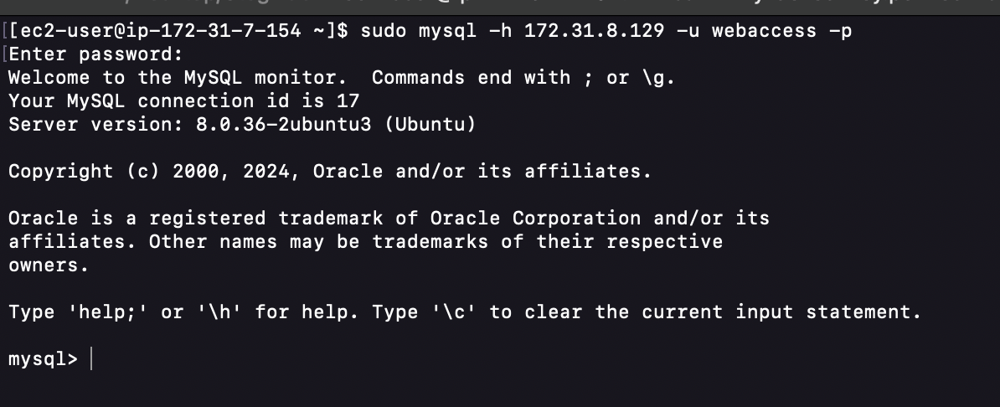
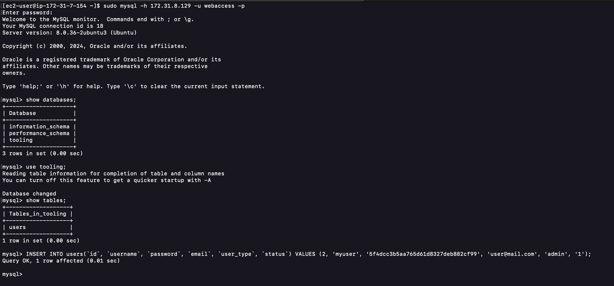

# DevOps Tooling Website Solution

## Introduction

This project involves implementing a solution that consists of the following components:

-   **Infrastructure**: AWS
-   **Web Server Linux**: Red Hat Enterprise Linux 9
-   **Database Server**: Ubuntu Linux + MySQL
-   **Storage Server**: Red Hat Enterprise Linux 9 + NFS Server
-   **Programming Language**: PHP
-   **Code Repository**: GitHub

The diagram below shows the architecture of the solution.



## Step 1 - Prepare NFS Server

1. **Spin up an EC2 instance with RHEL Operating System, use RedHat on AWS**

    

2. **Configure Logical Volume Management (LVM) on the server**

    - Format the LVM as xfs.
    - Create 3 Logical Volumes: `lv-opt`, `lv-apps`, `lv-logs`.
    - Create mount points on the `/mnt` directory for the logical volumes as follows:

        - Mount `lv-apps` on `/mnt/apps` for web servers.
        - Mount `lv-logs` on `/mnt/logs` for web server logs.
        - Mount `lv-opt` on `/mnt/opt` for the Jenkins server in the next project.

    - **Create 3 volumes in the same AZ as the NFS Server EC2, each of 10GB, and attach them to the NFS Server.**

        

    - **Open the Linux terminal to begin configuration.**

        ```bash
        ssh -i "my-devec2key.pem" ec2-user@18.224.38.96
        ```

        

    - **Use `lsblk` to inspect what block devices are attached to the server.**

        ```bash
        lsblk
        ```

        

    - **Use `gdisk` to create a single partition on each of the 3 disks.**

        ```bash
        sudo gdisk /dev/xvdf
        sudo gdisk /dev/xvdg
        sudo gdisk /dev/xvdh
        ```

        
        
        

    - **Use `lsblk` to view the newly configured partitions.**

        ```bash
        lsblk
        ```

        

    - **Install `lvm2` package.**

        ```bash
        sudo yum install lvm2 -y
        ```

        

    - **Use `pvcreate` to mark each of the 3 disks as physical volumes (PVs) for LVM.**

        ```bash
        sudo pvcreate /dev/xvdf1 /dev/xvdg1 /dev/xvdh1
        sudo pvs
        ```

        

    - **Use `vgcreate` to add all 3 PVs to a volume group (VG) named `webdata-vg`.**

        ```bash
        sudo vgcreate webdata-vg /dev/xvdf1 /dev/xvdg1 /dev/xvdh1
        sudo vgs
        ```

        

    - **Use `lvcreate` to create 3 logical volumes: `lv-apps`, `lv-logs`, and `lv-opt`.**

        ```bash
        sudo lvcreate -n lv-apps -L 9G webdata-vg
        sudo lvcreate -n lv-logs -L 9G webdata-vg
        sudo lvcreate -n lv-opt -L 9G webdata-vg
        sudo lvs
        ```

        

    - **Verify the entire setup.**

        ```bash
        sudo vgdisplay -v   #view complete setup, VG, PV and LV
        lsblk
        ```

        
        

    - **Format the logical volumes with the xfs filesystem.**

        ```bash
        sudo mkfs -t xfs /dev/webdata-vg/lv-apps
        sudo mkfs -t xfs /dev/webdata-vg/lv-logs
        sudo mkfs -t xfs /dev/webdata-vg/lv-opt
        ```

        

    - **Create mount points in the `/mnt` directory.**

        ```bash
        sudo mkdir /mnt/apps
        sudo mkdir /mnt/logs
        sudo mkdir /mnt/opt
        sudo mount /dev/webdata-vg/lv-apps /mnt/apps
        sudo mount /dev/webdata-vg/lv-logs /mnt/logs
        sudo mount /dev/webdata-vg/lv-opt /mnt/opt
        ```

        

3. **Install NFS Server, configure it to start on reboot, and ensure it is up and running.**

    ```bash
    sudo yum update -y
    sudo yum install nfs-utils -y
    sudo systemctl start nfs-server.service
    sudo systemctl enable nfs-server.service
    sudo systemctl status nfs-server.service
    ```

    
    
    

4. **Export the mounts for Webservers' subnet CIDR to connect as clients.**

    - Set up permissions to allow the Web Servers to read, write, and execute files on NFS.

        ```bash
        sudo chown -R nobody: /mnt/apps
        sudo chown -R nobody: /mnt/logs
        sudo chown -R nobody: /mnt/opt
        sudo chmod -R 777 /mnt/apps
        sudo chmod -R 777 /mnt/logs
        sudo chmod -R 777 /mnt/opt
        sudo systemctl restart nfs-server.service
        ```

        

    - Configure access to NFS for clients within the same subnet.

        ```bash
        sudo vi /etc/exports

        /mnt/apps 172.31.0.0/16(rw,sync,no_all_squash,no_root_squash)
        /mnt/logs 172.31.0.0/16(rw,sync,no_all_squash,no_root_squash)
        /mnt/opt 172.31.0.0/16(rw,sync,no_all_squash,no_root_squash)

        sudo exportfs -arv
        ```

        > NB use your CIDR subnet ip

    
    

5. **Check which port is used by NFS and open it using the security group.**

    ```bash
    rpcinfo -p | grep nfs
    ```

    

    **Note**: For NFS Server to be accessible from the client, the following ports must be opened: TCP 111, UDP 111, UDP 2049, NFS 2049. Set the Web Server subnet CIDR as the source.

    

## Step 2 - Configure the Database Server

1. **Launch an Ubuntu EC2 instance for the DB Server.**

    

2. **Access the instance to begin configuration.**

    ```bash
    ssh -i "my-devec2key.pem" ubuntu@18.116.87.242
    ```

    

3. **Update and upgrade Ubuntu.**

    ```bash
    sudo apt update && sudo apt upgrade -y
    ```

    

4. **Install MySQL Server.**

    - Install MySQL server.

        ```bash
        sudo apt install mysql-server
        ```

        

    - Run MySQL secure installation script.

        ```bash
        sudo mysql_secure_installation
        ```

5. **Create a database named `tooling`.**

6. **Create a database user named `webaccess`.**

7. **Grant permission to `webaccess` user on `tooling` database from the webservers' subnet CIDR.**

    ```sql
    sudo mysql

    CREATE DATABASE tooling;
    CREATE USER 'webaccess'@'172.31.0.0/16' IDENTIFIED WITH mysql_native_password BY 'Admin123$';
    GRANT ALL PRIVILEGES ON tooling.* TO 'webaccess'@'172.31.0.0/16' WITH GRANT OPTION;
    FLUSH PRIVILEGES;
    show databases;

    use tooling;
    select host, user from mysql.user;
    exit
    ```

    
    

8. \*\*Set Bind Address and

port (3306) for MySQL in the configuration file.\*\*

-   Edit MySQL config file to allow connections from the webservers subnet.

    ```bash
    sudo vi /etc/mysql/mysql.conf.d/mysqld.cnf
    ```

-   Change the `bind-address` to allow connections from any IP address.

    ```ini
    bind-address = 0.0.0.0
    ```

    

9. **Restart MySQL to apply changes.**

    ```bash
    sudo systemctl restart mysql
    sudo systemctl status mysql
    ```

    

10. **Open port 3306 on the database security group to allow access from the webserver subnet CIDR.**

## Step 3 - Prepare the Web Server

1. **Launch 3 RHEL EC2 instances for the web servers.**

    

2. **Install NFS client on both servers and mount the NFS directory.**

    - SSH into each web server instance.

        ```bash
        ssh -i "my-devec2key.pem" ec2-user@3.140.255.174
        ssh -i "my-devec2key.pem" ec2-user@3.129.221.24
        ```

        

    - Install NFS client on both servers.

        ```bash
        sudo yum install nfs-utils nfs4-acl-tools -y
        sudo systemctl start nfs-client.target
        sudo systemctl enable nfs-client.target
        sudo systemctl status nfs-client.target
        ```

        

    - Mount NFS shares from the NFS server to the web servers.

        ```bash
        sudo mkdir /var/www
        sudo mkdir /var/log/httpd
        sudo mount -t nfs4 -o rw,sync,noatime,hard,intr,nolock 18.224.38.96:/mnt/apps /var/www
        sudo mount -t nfs4 -o rw,sync,noatime,hard,intr,nolock 18.224.38.96:/mnt/logs /var/log/httpd
        ```

        
        

    - Verify the mounts.

        ```bash
        df -h
        ```

        

3. **Install Apache and PHP on both web servers.**

    - Install Apache.

        ```bash
        sudo yum install httpd -y
        ```

        

    - Start and enable Apache.

        ```bash
        sudo systemctl start httpd
        sudo systemctl enable httpd
        sudo systemctl status httpd
        ```

        

    - Install PHP.

        ```bash
        sudo yum install php php-mysqlnd -y
        ```

        

4. **Clone the repository from GitHub to the web servers.**
   fork this [repo](https://github.com/StegTechHub/tooling.git) on github and clone your forked version.

    ```bash
    sudo yum install git -y
    cd /var/www
    sudo git clone https://github.com/<your-github-username>/tooling.git
    ```

    

    ```sh
    cd tooling
    ls
    ```

    
    
    - copy the content of `tooling/html` to `/var/www/html`
    ```sh
      sudo cp -R html/. /var/www/html/
    ```
    

5. **Configure the database connection in the application.**

    - Update the database connection settings in the application configuration file.

        ```bash
        sudo vi /var/www/html/functions.php
        ```

    - Set the following database connection parameters.

        ```php
        $db = mysqli_connect('18.116.87.242', 'webaccess', 'Admin123$', 'tooling');
        ```
    

    ```sh
    sudo mysql -h 172.31.8.129 -u webaccess -p tooling < tooling-db.sql
    ```
  
  - Access the database server from Web Server
  ```sh
    sudo mysql -h 172.31.8.129 -u webaccess -p
  ```
  

  - Create in MyQSL a new admin user with username: myuser and password: password

  ```sql
    INSERT INTO users(id, username, password, email, user_type, status) VALUES (2, 'myuser', '5f4dcc3b5aa765d61d8327deb882cf99', 'user@mail.com', 'admin', '1');
  ```

  
6. **Test the application.**

    - Open the browser and navigate to the public IP address of the web servers.

  
  

## Conclusion

The project is successfully implemented with a fully functional 3-tier architecture, including an NFS server for shared storage, a database server for data management, and web servers serving the application.
