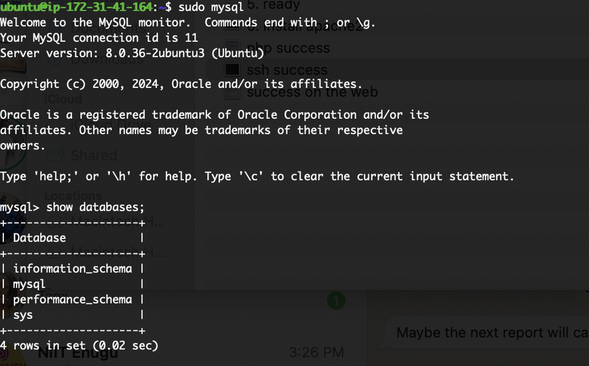
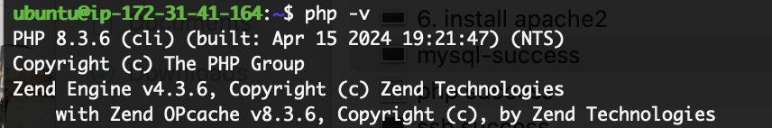

# Deployment of a LAMP Stack Project on AWS

This piece covers a walk through the process of deploying a LAMP (Linux, Apache, MySQL, PHP) stack project on AWS (Amazon Web Services). It cover each step in detail, including installation and configuration.

## Step 0: Prerequisites

Before we begin, ensure you have the following prerequisites:
- Create a free AWS account: [AWS Console](https://aws.amazon.com/)
- Start an EC2 instance: [EC2 Dashboard](https://console.aws.amazon.com/ec2/)


- when created and successful, you should see something like this


- clicking on the instance id will take you to a page to access your instance and check status, originally would be in an initialization state, but after a few minutes, it will be in a running state


- when ready will look like this


- to ssh into the instance you open your local terminal and type the following.

```sh
ssh -i "your-ec2-key.pem" ubuntu@your-insstace-ipv4
```

- Also you could click on the instance id and then click on connect


- when in you should see something like this


---
## Step 1: Installing Apache2

- First, let's install Apache2 on our EC2 instance.
```bash
sudo apt update
sudo apt install apache2 -y
```

> NB: inluding the flag -y will automatically answer yes to all prompts.

- Check Apache2 service status:
```bash
sudo systemctl status apache2
```


- Test Apache2 by visiting the public IPv4 address of your EC2 instance in a web browser or using `curl`:
```bash
curl http://<your_ec2_public_ip>
```


## Step 2: Installing MySQL Server

Next, let's install MySQL Server and secure it.
- To install `mysql-server` use the following commands
```bash
sudo apt install mysql-server -y
sudo mysql_secure_installation
```

- Follow the prompts to set a root password and secure MySQL Server.

- When done, type the command below to access the insalled mysql database
```sh
sudo mysql
```



- To exit the mysql database use the command below
```mysql
mysql> exit
```
## Step 3: Installing PHP and Relevant Packages
To install php and all nessesary packages, usse the following
- Install PHP and other necessary PHP packages.
```bash
sudo apt install php libapache2-mod-php php-mysql -y
```
The command will run and download a series of package. when done, you can check for success by using
```sh
php -v
```


## Step 4: Creating a Virtual Host

Now, let's create a virtual host for our site with Apache.
```bash
sudo nano /etc/apache2/sites-available/your_site.conf
```

Add the following configuration:
```apache
<VirtualHost *:80>
  ServerName your_site
  ServerAlias www.your_site
  ServerAdmin webmaster@localhost
  DocumentRoot /var/www/your_site
  ErrorLog ${APACHE_LOG_DIR}/error.log
  CustomLog ${APACHE_LOG_DIR}/access.log combined
</VirtualHost>
```

Enable the virtual host:
```bash
sudo a2ensite your_site.conf
sudo systemctl reload apache2
```

## Step 5: Enabling PHP on the Site

Finally, let's enable PHP on our site.
```bash
sudo nano /var/www/your_site/index.php
```

Add the following PHP code:
```php
<?php
phpinfo();
?>
```


Now, visit `http://<your_ec2_public_ip>/info.php` in a web browser to see PHP information.

That's it! You've successfully deployed a LAMP stack project on AWS.

## Conclusion
By following these steps, you have successfully deployed a LAMP stack project on AWS. This setup provides a solid foundation for hosting dynamic web applications and websites. Remember to regularly update and secure your server to ensure its stability and security.

