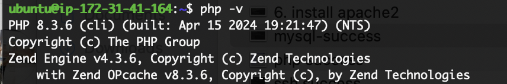

# Setting up the LEMP Webstack on AWS

The LEMP stack is a popular software bundle used to create a dynamic web server environment. It's an acronym that stands for:

* **L - Linux:** This is the operating system that provides the foundation for the entire stack. Linux is open-source, stable, and known for its efficiency.

* **E - Nginx (pronounced "engine-x"):** This is the web server software responsible for handling incoming HTTP requests, serving static content (like HTML files, images), and forwarding dynamic requests to the appropriate backend application. Nginx is known for its high performance and scalability.

* **M - MySQL:** This is the open-source relational database management system (RDBMS) used for storing website data. MySQL allows you to create databases, tables, and manage information like user accounts, product details, or blog posts. 

* **P - PHP:** This is a server-side scripting language used to create dynamic web pages. When a user interacts with a webpage, the PHP code on the server executes to generate customized content or interact with the MySQL database.

**Here's how the LEMP stack works together:**

1. **User Request:** A user opens a webpage in their browser, sending an HTTP request to the web server.
2. **Nginx:** The Nginx web server receives the request and checks if the requested content is static (e.g., HTML files, images).
3. **Serving Static Content:** If the content is static, Nginx delivers it directly to the user's browser.
4. **Dynamic Request:** If the request requires processing (e.g., login form submission), Nginx forwards it to the appropriate PHP script.
5. **PHP Processing:** The PHP script interacts with the MySQL database as needed, retrieving or storing data.
6. **Generating Dynamic Content:** The PHP script generates the HTML content based on the retrieved data or performed actions.
7. **Delivering Response:** Nginx receives the generated HTML content from PHP and sends it back to the user's browser, displaying the dynamic webpage.

**Benefits of LEMP Stack:**

* **Open-source and Free:** All components of the LEMP stack are open-source and free to use, making it a cost-effective solution for web development.
* **Scalability:** The LEMP stack is known for its ability to handle high traffic volumes efficiently.
* **Security:** Linux and Nginx offer a robust foundation for security, and MySQL provides user permissions and access controls for data protection.
* **Performance:** Nginx is known for its speed and efficiency, while PHP is a well-established language optimized for web development.
* **Flexibility:** The LEMP stack is versatile and can be used to develop a wide range of web applications, from simple blogs to complex e-commerce platforms.

**Alternatives to LEMP Stack:**

* **LAMP Stack:** This is the original version, using Apache instead of Nginx as the web server. 
* **LNMP Stack:** This variation uses Nginx as the web server and MariaDB (a community-developed fork of MySQL) as the database.

The choice between LEMP and its alternatives depends on specific project requirements and preferences. Nginx is often favored for its performance and scalability, while Apache might be preferred for familiarity or specific functionalities.

## Step 0 - Prerequisites
### Setting Up Amazon EC2 Instance

Amazon Elastic Compute Cloud (EC2) provides scalable computing capacity in the cloud. Here's a step-by-step guide to launching your first EC2 instance on AWS:

**1. Sign Up and Login**

* If you don't have an AWS account, sign up for a free tier account at [https://aws.amazon.com/](https://aws.amazon.com/).
* Login to the AWS Management Console at [https://aws.amazon.com/console/](https://aws.amazon.com/console/).

**2. Launch Instance**

* Search for "EC2" in the search bar and navigate to the Amazon EC2 service.
* Click on the orange "Launch Instance" button.


**3. Choose an AMI (Amazon Machine Image)**

* An AMI is a preconfigured software image containing an operating system and additional software.
* For beginners, we recommend choosing a free tier eligible AMI. Under "Free tier eligible," select an Amazon Linux 2 AMI.
* Click the "Select" button.

**4. Choose an Instance Type**

* Instance types define the computing capacity of your instance (CPU, memory, storage).
* For a basic setup, a free tier eligible t2.micro instance type is sufficient.
* Choose the desired instance type and click "Next: Configure Instance Details".

**5. Configure Instance Details**

* Leave the number of instances as 1.
* You can optionally change the network settings if needed. Otherwise, leave them at the default settings.
* Click on "Next: Add Storage".

**6. Add Storage**

* EC2 instances store data on Elastic Block Store (EBS) volumes.
* By default, an 8 GiB EBS volume is sufficient for basic setups. You can adjust the size based on your needs.
* Click on "Next: Add Tags".

**7. Add Tags (Optional)**

* Tags are key-value pairs that help you organize and identify your resources in AWS.
* You can add tags to your instance for better management (optional).
* Click on "Next: Configure Security Group".

**8. Configure Security Group**

* A security group acts as a firewall, controlling inbound and outbound traffic to your instance.
* For now, create a new security group with a descriptive name (e.g., "My-First-Security-Group").
* Click on "Edit" to add inbound rules.

**9. Add Inbound Rule**

* Click on "Add Rule".
* Choose "HTTP" for the type of traffic.
* Set the port range to "80" (standard web traffic port).
* You can restrict the source (where the traffic comes from) to "My IP" for initial testing or leave it open for public access (not recommended for production environments).
* Click "Save" on the inbound rule settings.

**10. Review and Launch**

* Review all the configuration details on the summary page.
* If everything looks good, click the orange "Launch" button.
* Choose an existing key pair or create a new key pair (securely store the downloaded private key file).
* Click on "Launch Instances".

**11. Instance Launch**

* Your EC2 instance will now be launched. It might take a few minutes for the status to change to "running".


**12. Accessing Your Instance**

* Once the instance is running, go to the "Instances" list in the EC2 console.
* You can see the public DNS name of your instance. 
*  **Optional: Connect using SSH Client**
    * To remotely connect to your Linux instance, you'll need an SSH client like PuTTY (Windows) or the built-in terminal (Mac/Linux).
    * Launch your SSH client and connect to the public DNS name of your instance with the username "ec2-user" (default for Amazon Linux 2).
    * Use the private key file you downloaded earlier to authenticate the connection.


Congratulations! You've successfully launched your first EC2 instance on AWS. You can now start using it to deploy your web applications or for any other computing tasks you require.


## Step 1 - Installing Nginx Web Server on Your EC2 Instance

Now that you have your EC2 instance up and running on AWS, let's install the Nginx web server to deliver web content. Here's a guide assuming you're connected to your instance via an SSH client:

**1. Update Package Lists:**

```
sudo apt update
```

This command updates the list of available packages on your Amazon Linux 2 instance.

**2. Install Nginx:**

```
sudo apt install nginx -y
```

This command installs the Nginx web server package using the `yum` package manager.

**3. Start Nginx:**

```
sudo systemctl start nginx
```

This command starts the Nginx service, making it operational.

**4. Verify Nginx Status:**

```
sudo systemctl status nginx
```

This command checks the status of the Nginx service and confirms if it's running successfully.


**5. Check Web Server Accessibility (Optional):**

* If you allowed public access to your instance in the security group configuration during launch, you can try accessing the public DNS name of your instance in a web browser to see the default Nginx welcome page.


## Step 2 - Installing MySQL

To install and setup MySQL follow the  following steps, 

**1. Update Package Lists:**

```bash
sudo apt update
```

This ensures you have the latest information about available packages.

**2. Install MySQL Server:**

```bash
sudo apt install mysql-server
```

This command downloads and installs the MySQL server package.


**3. Secure MySQL Installation:**

After installation, a crucial step is to secure your MySQL server using the `mysql_secure_installation` script. This script prompts you to set a root password for the MySQL user and performs other security measures. Here's how to run it securely:

```bash
sudo mysql_secure_installation
```

**Follow the prompts carefully:**

* **Enter current root password:** By default, there's no root password set yet, so press Enter.
* **Set root password:** Enter a strong and unique password for the MySQL root user. Re-enter it to confirm.
* **Remove anonymous users:** It's recommended to remove anonymous user access (press Y).
* **Disallow root login remotely:** For enhanced security, disallow root logins from remote machines (usually recommended, press Y).
* **Remove test database:** You can safely remove the test database (press Y).
* **Reload privilege tables:** This ensures the changes take effect (press Y).

**4. Verify MySQL Status:**

```bash
sudo systemctl status mysql
```

This command checks if the MySQL service is running correctly.

**5. Test MySQL Connection (Optional):**

Once secured, you can test the connection using the following command (replace "your_password" with the root password you set):

```bash
mysql -u root -p your_password
```

If successful, you'll be prompted to enter the password and then be able to interact with the MySQL prompt. Remember to exit using `exit;` when finished.

## Step 3 - Installing PHP on Your EC2 Instance
Now that you have Nginx web server and MySQL database potentially set up on your EC2 instance (remember, the previous guide assumed Ubuntu/Debian with apt, so adjust package managers accordingly), it's time to install PHP to connect them and create dynamic web applications. Here's how to install PHP on your EC2 instance:

**1. Update Package Lists:**

```bash
sudo apt update
```

This ensures you have the latest information about available packages.

**2. Install PHP-FPM and MySQL Connector:**

```bash
sudo apt install php-fpm php-mysql
```

This single command installs two crucial packages:

* **php-fpm:** This package provides the FastCGI Process Manager (FPM) for PHP, a more efficient and scalable way to handle PHP requests compared to the traditional mod_php Apache module.
* **php-mysql:** This extension enables your PHP scripts to connect and interact with MySQL databases.

**3. Verify Installation (Optional):**

You can verify the PHP-FPM installation by running:

```bash
php -v
```


This should display the installed PHP version information.

**Additional Notes:**

* This guide provides a basic installation process. Explore the official PHP documentation ([https://www.php.net/docs.php](https://www.php.net/docs.php)) for deeper understanding and advanced configurations.
* Remember to configure your web server (like Apache or Nginx) to work with PHP-FPM. This typically involves editing configuration files to point to the PHP-FPM socket or process.

## Step 4:  Here's how to configure Nginx to use PHP-FPM as the PHP preprocessor on your Ubuntu EC2 instance:

**1. Install Additional Packages (if not already installed):**

```bash
sudo apt install libnginx-mod-fastcgi
```

This installs the `libnginx-mod-fastcgi` module, which provides Nginx with the ability to interact with FastCGI applications like PHP-FPM.

**2. Configure Nginx:**

There are two main approaches to configure Nginx for PHP-FPM:

**A. Using a Separate PHP-FPM Pool Configuration File:**

1. Locate the main Nginx configuration file. It's usually found at `/etc/nginx/nginx.conf`. You can use a text editor like `nano` to edit it:

   ```bash
   sudo nano /etc/nginx/nginx.conf
   ```

2. Find the `http` block in the configuration file. This block defines global server settings.

3. Inside the `http` block, add a new server block for your website or application. Here's an example:

   ```nginx
   server {
       listen 80; # adjust port if needed
       server_name your_domain_name; # replace with your actual domain name

       # Access log and error log configuration (optional)
       access_log /var/log/nginx/your_domain_name.access.log;
       error_log /var/log/nginx/your_domain_name.error.log;

       location / {
           # Replace with the path to your application's root directory
           root /var/www/html/your_application_folder;
           index index.php index.html index.htm;

           # Pass PHP requests to PHP-FPM
           try_files $uri $uri/ /index.php?$args;

           # Define PHP-FPM settings
           location ~ \.php$ {
               fastcgi_pass unix:/run/php/php-fpm.sock; # adjust path if socket location differs
               fastcgi_index index.php;
               include /etc/nginx/fastcgi_params; # include common FastCGI parameters
           }
       }
   }
   ```

   * Replace `your_domain_name` with your actual domain name.
   * Adjust `root` directive to point to your application's document root directory.
   * The `try_files` directive ensures Nginx serves static files directly and forwards PHP requests to the defined location block.
   * The `location ~ \.php$` block handles PHP file processing.
      * `fastcgi_pass` specifies the path to the PHP-FPM socket (usually `/run/php/php-fpm.sock`).
      * `fastcgi_index` defines the default index file for PHP requests.
      * `include /etc/nginx/fastcgi_params` incorporates common FastCGI parameters for efficient communication between Nginx and PHP-FPM.
    * At the end, You'll have something like this
    ```nginx
    #/etc/nginx/sites-available/projectLEMP

    server {
        listen 80;
        server_name projectLEMP www.projectLEMP;
        root /var/www/projectLEMP;

        index index.html index.htm index.php;

        location / {
            try_files $uri $uri/ =404;
        }

        location ~ \.php$ {
            include snippets/fastcgi-php.conf;
            fastcgi_pass unix:/var/run/php/php8.1-fpm.sock;
        }

        location ~ /\.ht {
            deny all;
        }

    }
    ```

4. Save and close the configuration file (Ctrl+O, then Enter, followed by Ctrl+X).

### Undersstanding the configuration file

**1. server { ... }:**

* This block defines a virtual server configuration in Nginx. It essentially creates a blueprint for how Nginx handles requests directed to a specific domain name or IP address.

**2. listen 80;**

* This line tells Nginx to listen for incoming connections on port 80, the standard HTTP port.

**3. server_name projectLEMP www.projectLEMP;**

* This line specifies the server names that this configuration block applies to. Here, it handles requests for both `projectLEMP` and `www.projectLEMP`.

**4. root /var/www/projectLEMP;**

* This line defines the document root directory for this server block. This is the directory where Nginx searches for requested files (like HTML, CSS, or PHP scripts). In this case, it looks in the `/var/www/projectLEMP` directory.

**5. index index.html index.htm index.php;**

* This line defines a list of preferred index files. When a directory is requested (without a specific filename), Nginx will search for these files in the order listed. It will serve the first one it finds. This allows you to use different file extensions as your default page (e.g., `index.html` for static websites or `index.php` for dynamic PHP applications).

**6. location / { ... }:**

* This location block defines a general rule for all requests to the server.

**7. try_files $uri $uri/ =404;**

* This line uses the `try_files` directive. It instructs Nginx to try the following:
    * First, it checks for the exact requested URI (path) as is (`$uri`).
    * If the file doesn't exist, it tries appending a trailing slash (`$uri/`). This can be useful for handling directory listings or applications that expect URLs to end with a slash.
    * If neither of the previous attempts locate a file, Nginx returns a 404 Not Found status code (`=404`).

**8. location ~ \.php$ { ... }:**

* This location block specifically handles requests for files ending with the `.php` extension. The `~` symbol indicates a regular expression match.

**9. include snippets/fastcgi-php.conf;**

* This line includes another configuration file named `snippets/fastcgi-php.conf`. This is likely a separate file containing settings related to how Nginx interacts with PHP using FastCGI Process Manager (FPM). It might define things like additional FastCGI parameters or security restrictions.

**10. fastcgi_pass unix:/var/run/php/php8.1-fpm.sock;**

* This line specifies how to handle PHP requests. 
    * `fastcgi_pass` tells Nginx to forward these requests to a FastCGI server (likely PHP-FPM).
    * `unix:/var/run/php/php8.1-fpm.sock` defines the path to the PHP-FPM socket file. In this case, it's a Unix domain socket located at `/var/run/php/php8.1-fpm.sock`. This socket acts as the communication channel between Nginx and PHP-FPM.

**11. location ~ /\.ht { ... }:**

* This location block likely serves as a security measure.
    * The `~` symbol with `.ht` matches files or directories starting with a dot and ending with `.ht` (e.g., `.htaccess`).
    * `deny all;` instructs Nginx to deny access to any requests for such files or directories. This helps prevent users from accessing configuration files that might be sensitive.

In summary, this Nginx configuration manages a virtual server for a project named "projectLEMP". It serves static content from the `/var/www/projectLEMP` directory, handles PHP requests by forwarding them to a PHP-FPM socket, and employs some basic security measures. The inclusion of `snippets/fastcgi-php.conf` suggests there might be additional configuration details related to PHP processing in that separate file.

**B. Using a Server Block with Included PHP-FPM Configuration:**

1. Follow steps 1 and 2 from method A to locate and open the Nginx configuration file.

2. Create a new server block similar to method A, but instead of including the `fastcgi_params` and `fastcgi_pass` directives directly, define a separate location block for PHP-FPM configuration:

   ```nginx
   server {
       # ... (server and location block configuration as in method A)

       location ~ \.php$ {
           include /etc/nginx/php-fpm.conf; # include a separate file for PHP-FPM settings
       }
   }
   ```

3. Create a new file named `php-fpm.conf` (or any desired name) in the directory containing your main Nginx configuration file (usually `/etc/nginx/`).

4. Add the following content to the `php-fpm.conf` file:

   ```nginx
   fastcgi_pass unix:/run/php/php-fpm.sock;
   fastcgi_index index.php;
   include /etc/nginx/fastcgi_params;
   ```

5. Save and close both configuration files.

**3. Restart Nginx:**

```bash
sudo systemctl restart nginx
```

This restarts Nginx with the new configuration.

**4. Test Your Configuration (Optional):**

* Create a simple PHP script (e.g., `info.php`) in your application's document root directory:

   ```php
   <?php
   phpinfo();
   ?>


## Step 5: Testing PHP with nginx
Here are two methods you can use to test PHP with Nginx on your server:

**Method 1: Using a Simple PHP Script (Recommended):**

1. **Create a Test Script:**

   * Use a text editor like `nano` to create a file named `info.php` in the document root directory of your Nginx server block (usually `/var/www/html/projectLEMP` in the provided example).

   * Add the following content to the `info.php` file:

     ```php
     <?php
     phpinfo();
     ?>
     ```

   * This script utilizes the `phpinfo()` function to display detailed information about your PHP configuration.

2. **Save and Close the File:**

   * After adding the content, save and close the `info.php` file using `Ctrl+O` followed by `Enter`, then `Ctrl+X`.

3. **Access the Script in Your Browser:**

   * If everything is configured correctly, your browser should display the PHP information page, providing details about your PHP version, modules, and configuration settings.

**Method 2: Using the Command Line (Optional):**

1. **Use the `curl` Command (if installed):**

   * If you have the `curl` command-line utility installed on your server, you can use it to test basic functionality:

     ```bash
     curl http://server_ip/info.php
     ```

     * Replace `server_ip` with your server's domain name or IP address if you're accessing it remotely.

     * This command sends a GET request to the `info.php` script and displays the response in your terminal. You should see the raw PHP information output.

2. **Check Nginx Error Logs (if script fails):**

   * If the script fails to display information or you encounter errors, check the Nginx error logs for clues:

     ```bash
     sudo nano /var/log/nginx/error.log
     ```

     * Look for any errors related to PHP processing or FastCGI communication. The error messages might provide insights into configuration issues or other problems.


## Step 6: Retrieving data from MySQL with PHP

To begin, access your MySQL server and create a database named `example_database`. Then, create a user with the password `PassWord.1`.

```sql
mysql> CREATE DATABASE example_database;
mysql> CREATE USER 'example_user'@'%' IDENTIFIED WITH mysql_native_password BY 'PassWord.1';
```

Grant all privileges to the user and log out. Then, log in as the newly created user.

```sql
mysql> GRANT ALL PRIVILEGES ON example_database.* TO 'example_user'@'%';
mysql> EXIT;
mysql -u example_user -p
```

Now, create a table named `todo_list` in the `example_database`.

```sql
mysql> USE example_database;
mysql> CREATE TABLE todo_list (
    -> item_id INT AUTO_INCREMENT,
    -> content VARCHAR(255),
    -> PRIMARY KEY(item_id)
    -> );
```

Next, insert some information into the table. When the information is checked, it should display as follows:

```sql
mysql> INSERT INTO todo_list (content) VALUES
    -> ('My first important item'),
    -> ('My second important item'),
    -> ('My third important item'),
    -> ('and this one more thing');
mysql> SELECT * FROM todo_list;
```

**Output:**
```
+---------+--------------------------+
| item_id | content                  |
+---------+--------------------------+
|       1 | My first important item  |
|       2 | My second important item |
|       3 | My third important item  |
|       4 | and this one more thing  |
+---------+--------------------------+
4 rows in set (0.000 sec)
```

Now, create a PHP file named `todo_list.php` in your project directory (`/var/www/projectLEMP`) and place the following code inside:

```php
<?php
$user = "example_user";
$password = "PassWord.1";
$database = "example_database";
$table = "todo_list";

try {
    $db = new PDO("mysql:host=localhost;dbname=$database", $user, $password);
    echo "<h2>TODO</h2><ol>";
    foreach($db->query("SELECT content FROM $table") as $row) {
        echo "<li>" . $row['content'] . "</li>";
    }
    echo "</ol>";
} catch (PDOException $e) {
    print "Error!: " . $e->getMessage() . "<br/>";
    die();
}
?>
```

This PHP script connects to the `example_database`, retrieves the `content` from the `todo_list` table, and displays it as a list.

If you have the `curl` command-line utility installed on your server, you can use it to test basic functionality:

```bash
  curl http://server_ip/info.php
```

Replace `server_ip` with your server's domain name or IP address if you're accessing it remotely.


> If you get an error 403, you'll need to check your php version and update your nginx configuration


- Check php version
```sh
php -v
```

- Open and edit your nginx configuration
```sh
sudo nano /etc/nginx/sites-available/projectLEMP
```

- Update the php version


When all are done correctly, you should see this
