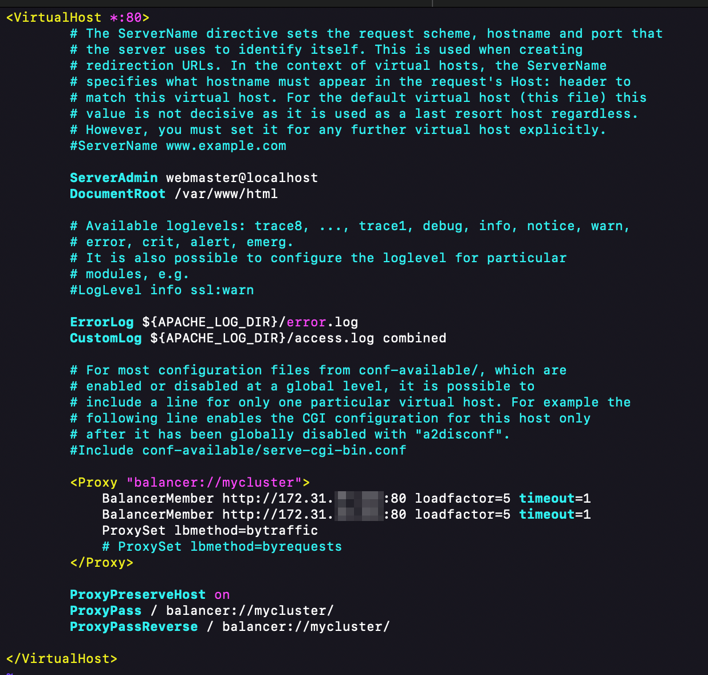

# Load Balancer Solution With Apache

A Load Balancer (LB) plays a critical role in modern web infrastructure by distributing client requests among multiple web servers, ensuring that the load is managed efficiently and no single server becomes a bottleneck. This process enhances the overall performance, reliability, and scalability of web applications. By distributing the traffic evenly, an LB prevents any one server from becoming overwhelmed, thereby maintaining high availability and fault tolerance. In this guide, we will deploy and configure an Apache Load Balancer on a separate Ubuntu EC2 instance for the Tooling Website solution. This setup will ensure that user requests are efficiently managed and served by the underlying web servers through the Load Balancer

The diagram below shows the architecture of the solution:


## Task
Deploy and configure an Apache Load Balancer for the Tooling Website solution on a separate Ubuntu EC2 instance. Ensure that users can be served by Web servers through the Load Balancer.

## Prerequisites

Ensure that the following servers are installed and configured:

- Two RHEL9 Web Servers
- One MySQL DB Server (based on Ubuntu 24.04)
- One RHEL9 NFS Server

> To learn how to set these up [click here](../web-solution-wordpress/README.md)

### Prerequisites Configurations

- Apache (httpd) is up and running on both Web Servers.
- `/var/www` directories of both Web Servers are mounted to `/mnt/apps` of the NFS Server.
- All necessary TCP/UDP ports are opened on Web, DB, and NFS Servers.
- Client browsers can access both Web Servers by their Public IP addresses or Public DNS names and can open the `Tooling Website` (e.g., `http://<Public-IP-Address-or-Public-DNS-Name>/index.php`).

# Step 1 - Configure Apache As A Load Balancer

## 1. Create an Ubuntu Server 24.04 EC2 instance and name it Apache LB or any name you  like


## 2. Install Apache Load Balancer on Apache LB and configure it to point traffic coming to LB to both Web Servers.

### i. Install Apache2

- Access the instance using SSH

```bash
ssh -i "my-devec2key.pem" ec2-user@18.219.148.178
```


- Update and upgrade Ubuntu

```bash
sudo apt update && sudo apt upgrade
```


- Now Install Apache

```bash
sudo apt install apache2 -y
```


- Install necessary dependencies

```bash
sudo apt-get install libxml2-dev
```


### ii. Enable the following modules

```bash
sudo a2enmod rewrite
sudo a2enmod proxy
sudo a2enmod proxy_balancer
sudo a2enmod proxy_http
sudo a2enmod headers
sudo a2enmod lbmethod_bytraffic
```


### iii. Restart Apache2 Service

```bash
sudo systemctl restart apache2
sudo systemctl status apache2
```


## Configure Load Balancing

### i. Open the file 000-default.conf in sites-available

```bash
sudo vi /etc/apache2/sites-available/000-default.conf
```

### ii. Add this configuration into the section `<VirtualHost *:80> </VirtualHost>`

```apache
<Proxy "balancer://mycluster">
    BalancerMember http://172.31.55.112:80 loadfactor=5 timeout=1
    BalancerMember http://172.31.38.232:80 loadfactor=5 timeout=1
    ProxySet lbmethod=bytraffic
    # ProxySet lbmethod=byrequests
</Proxy>

ProxyPreserveHost on
ProxyPass / balancer://mycluster/
ProxyPassReverse / balancer://mycluster/
```


### iii. Restart Apache

```bash
sudo systemctl restart apache2
```


The `bytraffic` balancing method will distribute incoming load between the Web Servers according to the current traffic load. The proportion in which traffic must be distributed can be controlled by the `loadfactor` parameter. Other methods such as `bybusyness`, `byrequests`, and `heartbeat` can also be adopted.

## 4. Verify that the configuration works

### i. Access the website using the LB's Public IP address or the Public DNS name from a browser


__Note__: If in the previous project, `/var/log/httpd` was mounted from the Web Server to the NFS Server, unmount them and ensure that each Web Server has its own log directory.

### ii. Unmount the NFS directory

- Check if the Web Server's log directory is mounted to NFS

```bash
df -h
sudo umount -f /var/log/httpd
```
If the directory is busy, the services using it need to be stopped first.
```bash
sudo systemctl stop httpd
```

- Check that the directory is unmounted

```bash
df -h
```


### iii. Open two SSH consoles for both Web Servers and run the command:

```bash
sudo tail -f /var/log/httpd/access_log
```
Web Server 1 `access_log`:


Web Server 2 `access_log`:


### iv. Refresh the browser page several times and ensure both Web Servers receive HTTP and GET requests. New records must appear in each Web Server's log files. The number of requests to each server will be approximately the same since `loadfactor` is set to the same value for both servers. This means that traffic will be evenly distributed between them.

Web Server 1 `access_log`:


Web Server 2 `access_log`:


# Optional Step - Configure Local DNS Names Resolution

Sometimes it is tedious to remember and switch between IP addresses, especially if there are lots of servers to manage. It is best to configure local domain name resolution. The easiest way is to use the `/etc/hosts` file. Although this approach is not very scalable, it is very easy to configure and shows the concept well.

## Configure the IP address to domain name mapping for our Load Balancer.

### Open the hosts file

```bash
sudo vi /etc/hosts
```

### Add two records into the file with Local IP address and arbitrary names for the Web Servers


### Update the LB config file with those arbitrary names instead of IP addresses

```bash
sudo vi /etc/apache2/sites-available/000-default.conf
```

```apache
BalancerMember http://Web1:80 loadfactor=5 timeout=1
BalancerMember http://Web2:80 loadfactor=5 timeout=1
```


### Try to curl the Web Servers from LB locally

```bash
curl http://Web1
```


```bash
curl http://Web2
```


Remember, this is only internal configuration and is local to the LB server. These names will neither be 'resolvable' from other servers internally nor from the Internet.

### Conclusion

The mod_proxy_balancer module in Apache HTTP Server offers a comprehensive suite of features for load balancing, which includes support for sticky sessions, health checks, and various load balancing algorithms. By properly configuring these options, you can ensure that your web applications are highly available, scalable, and reliable. This setup not only optimizes the distribution of traffic among the web servers but also enhances the overall user experience by reducing response times and improving the fault tolerance of your infrastructure. Implementing an Apache Load Balancer as outlined ensures that your web servers can handle increased loads and provides a robust solution for managing web traffic effectively.