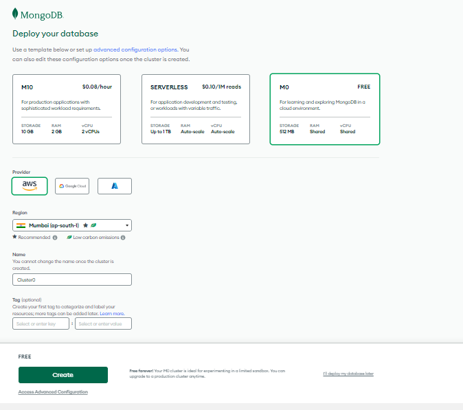

# MERN Stack on AWS: Setting Up and Deployment

MERN (MongoDB, Express, React, Node.js) is a popular full-stack development approach. Here's a breakdown of setting up and deploying a MERN stack application on AWS:

## Step 0: Prerequisites - Setting up your EC2 instance

* Getting an AWS Account with Admin privileges ([https://aws.amazon.com/getting-started/](https://aws.amazon.com/getting-started/))
* Now Setup and launch your EC2 instance using an ubuntu/dabian image on AWS.


using SSH, connect to your EC2 instance from your local terminal. 
```sh
ssh -i "path-to-private-key" ubuntu@eserver-ip
```
When you're in, you'll get a window like this on your local terminal


Now your are ready for the next step

For this setup, we'll be debloying a TODO app. 

## Step 1: Backend Configuration

To get the backend configured, ssh into your EC2 instance, and run the following to update and upgrade ubuntu.
```sh
apt update
```
and then 

```sh
apt upgrade
```

Now we will get Node.js from the [ubuntu repository](https://github.com/nodesource/distributions#deb).
```sh
curl -fsSL https://deb.nodesource.com/setup_18.x | sudo -E bash -

``` 


After downloading, it's time to install the Node.js using the command below
```sh
 sudo apt-get install -y nodejs
```
This will install the downloaded Node.js filles


The above command will install Node.js and Node Package Manager (NPM) to verify this, use the commands

for Node.js
```sh
node -v
```
for NPM
```sh
npm -v
```


### Setup Application Code
To get started on the Todo App, you'll create a directory
```sh
mkdir Todo
```

You can check the created directory with 
```sh
ls
```
Now let's navigate into the directory and start hacking.
```sh
cd Todo
```


### Now lets install ExpressJs

Using the command below, let's install express.js and use `ls` to confirm
```sh
npm install express
```


To setup the server and routes using the express library, we'll need to create a file on the root director of our application

```sh
touch index.js
```

next we install the `dotenv` package ussing the `npm` to help use environmental variables in Node/express application
```sh
npm install dotenv
``` 


We are are going to modify the file `index.js` using `vi` 
```sh
vi index.js
```

and add the following code


```js
const express = require('express');
require('dotenv').config();

const app = express();

const port = process.env.PORT || 5000;

app.use((req, res, next) => {
res.header("Access-Control-Allow-Origin", "\*");
res.header("Access-Control-Allow-Headers", "Origin, X-Requested-With, Content-Type, Accept");
next();
});

app.use((req, res, next) => {
res.send('Welcome to Express');
});

app.listen(port, () => {
console.log(`Server running on port ${port}`)
});
``` 


The application is configured to run on port 5000

Now let's test the application by starting the server using the following command
```sh
node index.js
```
you'll get a response like this.


You can access this from the web browser using your IPv4 and port number
```sh
http://your-domain-or-server-ip:5000
```


> NB: You will need to modify your security group and allow inbound rule from port 5000 to view the application on your web browser

### Allow Port from Security group
To do thiss, go to your EC2 dashboard,

select the instance you'd like to modify and click on `security` on the bottom menu


Select your `security group` id


Click on `Edit Inbound Rule`


add the port number you wish to allow


### Models
After successfully testing your server, Now lets add some routes to our backend application
To Set up the model, which will be used in interacting with the database, we install an `ODM` named `mongoose` using NPM
```sh
$ npm install mongoose
```


first we make a new directory on the root directory of the application
```sh
mkdir models
```
move into the directory
```ssh
cd models
```
create an empty file
```sh
touch todo.js
```
> The `touch` command is used in creating a empty file and you can combine all comand with `mkdir models && cd models && touch todo.js`
Add the following code to the the file
```sh
const mongoose = require('mongoose');
const Schema = mongoose.Schema;

//create schema for todo
const TodoSchema = new Schema({
    action: {
    type: String,
    required: [true, 'The todo text field is required']
    }
})

//create model for todo
const Todo = mongoose.model('todo', TodoSchema);

module.exports = Todo;
```


### Routes
Now let's set up the route

first we make a new directory
```sh
mkdir routes
```
move into the directory
```ssh
cd routes
```
create an empty file
```sh
touch api.js
```

Now lets write to the file we just created
```sh
vi api.js
```
We'll add the following code into the file
```js
const express = require ('express');
const router = express.Router();
const Todo = require('../models/todo');

router.get('/todos', (req, res, next) => {

//this will return all the data, exposing only the id and action field to the client
Todo.find({}, 'action')
.then(data => res.json(data))
.catch(next)
});

router.post('/todos', (req, res, next) => {
if(req.body.action){
Todo.create(req.body)
.then(data => res.json(data))
.catch(next)
}else {
res.json({
error: "The input field is empty"
})
}
});

router.delete('/todos/:id', (req, res, next) => {
Todo.findOneAndDelete({"_id": req.params.id})
.then(data => res.json(data))
.catch(next)
})

module.exports = router;
```


### Mongo Database
To set up your mongo database, you'll need a mongo atlas account [create here](https://account.mongodb.com/) 

After that, Fill in all the mandatory or required details about yourself and the project for which you are using Atlas cloud and accept the terms & conditions then click on “Finish“.

Choose the Cloud database Tier for Cluster from the given below in the MongoDB atlas page as per your project convenience. Now, Let’s use the “M0” Free version, and in the region. if you want to name your cluster so that you can rename it as well but by, default it will have the name “cluster0” if you are creating for the first time then, Click on “Create“.


Now, you will be redirected to the home page, where you will be able to see all the details about your databases, organizations, projects, and other relevant information the next steps are:

Click on “Database” on the left panel of your screen. After that you will be able to see your created cluster by name, We have created a Cluster named “Cluster0” you can see a button “Connect” and then simply click on it.


The connect button will bring a modal showing you all connection methods like so


Choose the Drivers connection to get string that would help you intergrate  with application framework like Node.js, copy your connection string


> remeber to input your password

On the root of your project create a new file `.env`

```sh
touch .env
vi .env
```

And input your enviromental variable for the db
```.env
DB = 'mongodb+srv://&lt;username&gt;:&lt;password&gt;@&lt;network-address&gt;/&lt;dbname&gt;?retryWrites=true&amp;w=majority'
```
> remember to keep the file safe and protected

Now let's update the `index.js` file with more codes, open the `index.js` file
```sh
vi index.js
```

replace the existing code with this
```js
const express = require('express');
const bodyParser = require('body-parser');
const mongoose = require('mongoose');
const routes = require('./routes/api');
const path = require('path');
require('dotenv').config();

const app = express();

const port = process.env.PORT || 5000;

//connect to the database
mongoose.connect(process.env.DB, { useNewUrlParser: true, useUnifiedTopology: true })
.then(() => console.log(`Database connected successfully`))
.catch(err => console.log(err));

//since mongoose promise is depreciated, we overide it with node's promise
mongoose.Promise = global.Promise;

app.use((req, res, next) => {
res.header("Access-Control-Allow-Origin", "\*");
res.header("Access-Control-Allow-Headers", "Origin, X-Requested-With, Content-Type, Accept");
next();
});

app.use(bodyParser.json());

app.use('/api', routes);

app.use((err, req, res, next) => {
console.log(err);
next();
});

app.listen(port, () => {
console.log(`Server running on port ${port}`)
});
```


Now Let's start the server 
```sh
node index.js
```
and we get a success message, the db is connected and server is running on port 5000


Now lets test the endpoints by performing some [CRUD](./studies/RESTful-API.md#core-concepts-of-restful-apis) operation.

To do this, you can usse any API Development Client like [Postman](https://www.postman.com/downloads/) or [ThunderClient](https://www.thunderclient.com/). For this section we will be using ThunderClient becase it's lightweight and works directly inside the VS Code.

#### POST Request
To get started, Make sure your  server is running, then open your API Client 
- Create a request,
- Set the method to `POST` - this  will be  used to create an `action` into the **Todo Application**
- Inpute the URI to your resource 

```
    http://server-ip-or-domain:5000/api/todos
```
- Click on the body and select JSON and input the following
```json
{
    "action": "your task"
}
```

- Run/Send the request and you'll see a resopnse from the server


Do this a couple of time to input many task.

#### GET Requesst
Now to get the tasks back

- Change the Method to `GET`
- Everything else should remain as thay are.
- Run/Send the request and you'll see a resopnse from the server

You'll a get response with all the actions you have created

### Delete Request
- From  the list of actions, we'll copy one of the `_id` 
- Update The URI with the copied `_id`
```
    http://server-ip-or-domain:5000/api/todos/63627abe6253ab73
```
- Change the request method to `DELETE`
- Run/Send the request and you'll see a resopnse from the server

this will return information  of the deleted id.

## Step 2: Frondend Setup and Configurations
Since we are done with the functionality we want from our backend and API, it is time to create a user interface for a Web client (browser) to interact with the application via API. To start out with the frontend of the To-do app, we will use the `create vite@latest`. This is because it's lightweight and faster than CRA or `create-react-app`.

To install, run the following command and follow the prompt
```sh
npm create vite@latest
```


Run the next commands
```sh
cd Client
npm install
```
Then
```sh
npm run dev
```

After the server have been started successfully, you can stop it by pressing `Ctr-C` on your keyboard

Since we are using `VITE`, For us to explore the react app on our brouswer, we need to expose the `--host`. To do this,

- Open your `package.json` using `vi`
```sh
vi package.json
```
- Modify the dev script from `vite` to `vite --host`
```json
"scripts": {
    ...
    "dev": "vite --host"
}
```

Now start the react app again using 
```sh
npm run dev
```
and the server will start with the host ip expose, 

> For this to work you'll need to add the vite port `5173` to the list of inbound rule. [see here](#allow-port-from-security-group) 

Then enter the server ip and port on your web browser to ssee the welcome page


After this is done, stop the server and move the client directory to the Todo Directory 
```sh
mv ~/Client/ ~/Todo/
```
navigate to the TODO directory and install the following `concurrently` and `nodemon` using the command below
```sh
$ npm install concurrently --save-dev
```

```sh
$ npm install nodemon --save-dev
```


Now let's update the package.json for the node server to concurrently start the backend and frontend server.

Navigate to the root directory of your app and run the command below
```sh
vi package.json
```


### Configuring the proxy
Now let's configure the proxy, since we are using vite, this would be different from the way it's implemented with CRA

To do this, navigate to the `Client` directory and open the file `vite.config.js`
```sh
cd Client 
vi vite.config.js
```
> or you can do `vi Client/vite.config.js`

add the following codes
```js
server: {
    proxy: {
        '/api': 'http://locahost:5000',
    },
}
```


Now start the server
```
npm run dev
```


## Step 3: Creating the React components

To create the components, styles and application

Navigate to the `Client` directory and also to the `src` directory 
```
cd Client/src
```

Create a new directory `components` and navigate into it
```sh
mkdir components
cd components
```

Create the following files `Input.js`, `ListTodo.js` and `Todo.js`. 
```sh
touch Input.jsx ListTodo.jsx Todo.jsx
```

> Since we are using vite, the extention name would be `.jsx` instead of `.js`

Now  open the file `Input.jsx`
```
vi Input.jsx
```

Input the following code to the file
```js
import React, { Component } from 'react';
import axios from 'axios';

class Input extends Component {

state = {
action: ""
}

addTodo = () => {
const task = {action: this.state.action}

    if(task.action && task.action.length > 0){
      axios.post('/api/todos', task)
        .then(res => {
          if(res.data){
            this.props.getTodos();
            this.setState({action: ""})
          }
        })
        .catch(err => console.log(err))
    }else {
      console.log('input field required')
    }

}

handleChange = (e) => {
this.setState({
action: e.target.value
})
}

render() {
let { action } = this.state;
return (
<div>
<input type="text" onChange={this.handleChange} value={action} />
<button onClick={this.addTodo}>add todo</button>
</div>
)
}
}

export default Input
```

Next file `ListTodo.jsx`
```
vi ListTodo.jsx
```

add the following code
```js
import React from 'react';

const ListTodo = ({ todos, deleteTodo }) => {

return (
<ul>
{
todos &&
todos.length > 0 ?
(
todos.map(todo => {
return (
<li key={todo._id} onClick={() => deleteTodo(todo._id)}>{todo.action}</li>
)
})
)
:
(
<li>No todo(s) left</li>
)
}
</ul>
)
}

export default ListTodo
```

And then the `Todo.jsx`
```sh
vi Todo.jsx
```
input the command to it
```js
import React, {Component} from 'react';
import axios from 'axios';

import Input from './Input';
import ListTodo from './ListTodo';

class Todo extends Component {

state = {
todos: []
}

componentDidMount(){
this.getTodos();
}

getTodos = () => {
axios.get('/api/todos')
.then(res => {
if(res.data){
this.setState({
todos: res.data
})
}
})
.catch(err => console.log(err))
}

deleteTodo = (id) => {

    axios.delete(`/api/todos/${id}`)
      .then(res => {
        if(res.data){
          this.getTodos()
        }
      })
      .catch(err => console.log(err))

}

render() {
let { todos } = this.state;

    return(
      <div>
        <h1>My Todo(s)</h1>
        <Input getTodos={this.getTodos}/>
        <ListTodo todos={todos} deleteTodo={this.deleteTodo}/>
      </div>
    )

}
}

export default Todo;
```

Now lets go back to the previous directory
```
cd ..
```

Open the `App.js` file
```
vi App.js
```
replace the code there with this
```js
import React from 'react';

import Todo from './components/Todo';
import './App.css';

const App = () => {
return (
<div className="App">
<Todo />
</div>
);
}

export default App;
```

Open the App.css
```
vi App.css
```
replace the styling code their with the following
```css
.App {
text-align: center;
font-size: calc(10px + 2vmin);
width: 60%;
margin-left: auto;
margin-right: auto;
}

input {
height: 40px;
width: 50%;
border: none;
border-bottom: 2px #101113 solid;
background: none;
font-size: 1.5rem;
color: #787a80;
}

input:focus {
outline: none;
}

button {
width: 25%;
height: 45px;
border: none;
margin-left: 10px;
font-size: 25px;
background: #101113;
border-radius: 5px;
color: #787a80;
cursor: pointer;
}

button:focus {
outline: none;
}

ul {
list-style: none;
text-align: left;
padding: 15px;
background: #171a1f;
border-radius: 5px;
}

li {
padding: 15px;
font-size: 1.5rem;
margin-bottom: 15px;
background: #282c34;
border-radius: 5px;
overflow-wrap: break-word;
cursor: pointer;
}

@media only screen and (min-width: 300px) {
.App {
width: 80%;
}

input {
width: 100%
}

button {
width: 100%;
margin-top: 15px;
margin-left: 0;
}
}

@media only screen and (min-width: 640px) {
.App {
width: 60%;
}

input {
width: 50%;
}

button {
width: 30%;
margin-left: 10px;
margin-top: 0;
}
}
```

Open the `index.csss`
```
vi index.css
```
replace the styless there with this
```css
body {
margin: 0;
padding: 0;
font-family: -apple-system, BlinkMacSystemFont, "Segoe UI", "Roboto", "Oxygen",
"Ubuntu", "Cantarell", "Fira Sans", "Droid Sans", "Helvetica Neue",
sans-serif;
-webkit-font-smoothing: antialiased;
-moz-osx-font-smoothing: grayscale;
box-sizing: border-box;
background-color: #282c34;
color: #787a80;
}

code {
font-family: source-code-pro, Menlo, Monaco, Consolas, "Courier New",
monospace;
}
```

After we have finish setting up the client, we need to install one of the  package we used `axios`

to install this, use
```
npm install axios
```


To finish up, navigate to the root directory of the application and  start up the server again and accesss from the web terminal
```
cd ../..
npm run dev
```


visit the remote host ip on your browser and you'd see this


All new actionss added will  appear on your MongoDb Atlass Clusster

Explore the application by add and removing actions from the web terminal.